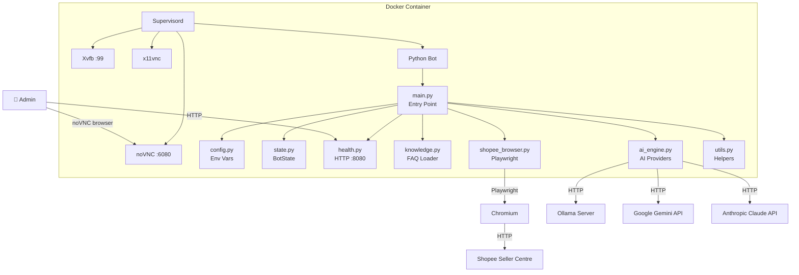
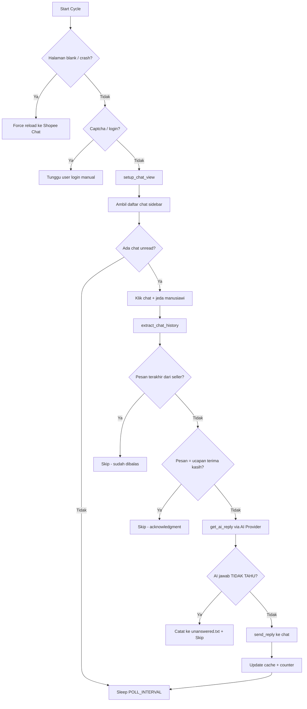

# 📄 Product Requirements Document (PRD)
## Shopee AutoChat Bot — v2.0

> **Versi:** 2.0  
> **Tanggal:** 8 Juli 2026  
> **Author:** cobacobiy  
> **Repository:** [cobacobiy/autochat](https://github.com/cobacobiy/autochat)  
> **Status:** In Development (branch `feature/improvements`)

---

## 1. Problem Statement

### Konteks Bisnis
Penjual (*seller*) di marketplace Shopee Indonesia menghadapi **beban operasional tinggi** dalam menangani obrolan masuk dari pembeli (*buyer*). Pada jam-jam sibuk (flash sale, payday, Harbolnas), sebuah toko bisa menerima ratusan pesan chat sekaligus. Shopee menggunakan **tingkat respons chat** sebagai salah satu metrik performa toko — respons lambat berdampak langsung pada penalti, turunnya peringkat pencarian, dan hilangnya badge "Star Seller".

### Masalah Utama
1. **Volume chat tinggi, tenaga CS terbatas.** Toko kecil-menengah (1-3 orang) tidak mampu menjawab semua chat secara real-time 24/7.
2. **Pertanyaan berulang (FAQ).** 70-80% pertanyaan pembeli bersifat repetitif: stok, harga, ongkir, COD, garansi, waktu pengiriman.
3. **Asisten AI bawaan Shopee terlalu generik.** Fitur AI Shopee tidak bisa dilatih dengan pengetahuan spesifik toko (FAQ custom, kebijakan toko, katalog produk).
4. **Tidak ada API resmi Shopee Chat.** Shopee tidak menyediakan API untuk chat otomatis, sehingga solusi yang ada harus menggunakan pendekatan *browser automation* (Playwright/Selenium).
5. **Risiko deteksi bot.** Automasi yang terlalu agresif bisa ditandai oleh sistem anti-bot Shopee, menyebabkan captcha, rate-limit, atau bahkan pemblokiran akun.

### Dampak Jika Tidak Diselesaikan
- Kehilangan calon pembeli karena tidak direspons
- Turunnya metrik performa toko di Shopee
- Beban kerja CS manual yang tidak sustainable
- Biaya outsource CS 24/7 yang mahal untuk UMKM

---

## 2. Goals

### Goal Utama
Membangun **bot auto-reply yang cerdas, aman, dan self-hosted** untuk menjawab chat pembeli di Shopee Seller Centre secara otomatis, dengan pengetahuan spesifik toko (*knowledge base*), sambil meminimalkan risiko deteksi bot.

### Goal Spesifik

| # | Goal | Metrik Sukses |
|---|------|---------------|
| G1 | Menjawab FAQ pembeli secara otomatis | ≥80% pertanyaan umum terjawab tanpa intervensi manusia |
| G2 | Menjaga respons time toko tetap tinggi | Chat rate ≥ 90% di dashboard Shopee |
| G3 | Menghindari deteksi bot oleh Shopee | 0 akun terblokir setelah 30 hari pemakaian |
| G4 | Memungkinkan eskalasi ke admin manusia | Pertanyaan yang tidak bisa dijawab dicatat & di-skip |
| G5 | Mendukung multi-AI provider | Bisa pakai Ollama (lokal), Gemini, atau Claude |
| G6 | Mudah di-deploy untuk UMKM | Deploy via Docker Compose dalam < 10 menit |

---

## 3. Target User

### Primary User: Penjual Shopee (Seller)
- **Profil:** Pemilik toko online di Shopee Indonesia, skala UMKM (1-10 orang)
- **Kategori produk:** Alat tulis, perlengkapan kantor, aksesoris — produk dengan FAQ yang predictable
- **Kemampuan teknis:** Bisa menjalankan perintah `docker compose up` dan mengakses VNC via browser
- **Motivasi:** Menghemat waktu & biaya CS tanpa kehilangan respons rate

### Secondary User: Admin CS (Customer Service)
- **Profil:** Staff yang menangani pertanyaan eskalasi dari bot
- **Interaksi:** Membaca file `unanswered_questions.txt` untuk menjawab pertanyaan yang tidak bisa dijawab AI
- **Motivasi:** Hanya menangani kasus yang benar-benar butuh judgment manusia

### Tertiary User: DevOps / System Administrator
- **Profil:** Orang yang mengelola server deployment
- **Interaksi:** Monitor health endpoint, VNC, logs, dan Docker container
- **Motivasi:** Memastikan bot stabil 24/7 tanpa downtime

---

## 4. User Stories

### Epic 1: Auto-Reply Chat

| ID | As a... | I want to... | So that... | Priority |
|----|---------|-------------|-----------|----------|
| US-01 | Seller | bot otomatis menjawab pertanyaan FAQ pembeli | saya tidak perlu menjawab pertanyaan yang sama berulang kali | P0 |
| US-02 | Seller | bot menjawab berdasarkan FAQ custom toko saya | jawaban sesuai dengan kebijakan dan katalog toko saya | P0 |
| US-03 | Seller | bot tidak menjawab jika tidak yakin | pertanyaan rumit tetap ditangani admin manusia | P0 |
| US-04 | Seller | bot mendeteksi pesan yang hanya berupa ucapan terima kasih ("ok", "sip") | chat acknowledgment tidak dijawab berulang | P1 |
| US-05 | Seller | bot bisa hot-reload knowledge base tanpa restart | saya bisa update FAQ tanpa downtime | P1 |

### Epic 2: Anti-Detection & Keamanan

| ID | As a... | I want to... | So that... | Priority |
|----|---------|-------------|-----------|----------|
| US-06 | Seller | bot berperilaku seperti manusia (jeda acak, klik natural) | akun saya tidak terdeteksi dan diblokir Shopee | P0 |
| US-07 | Seller | bot mendeteksi captcha/error page dan menunggu | bot tidak crash saat ada gangguan dari Shopee | P0 |
| US-08 | Seller | bot bisa mendeteksi dan menutup popup error Shopee | bot tidak macet karena modal overlay | P1 |
| US-09 | Seller | ada batas harian jumlah reply | bot tidak mengirim spam yang mencurigakan | P1 |

### Epic 3: Monitoring & Operasional

| ID | As a... | I want to... | So that... | Priority |
|----|---------|-------------|-----------|----------|
| US-10 | DevOps | melihat browser via VNC | saya bisa login manual dan debug masalah visual | P0 |
| US-11 | DevOps | health check endpoint (HTTP 8080) | monitoring tools bisa cek apakah bot hidup | P1 |
| US-12 | DevOps | log terstruktur (support JSON format) | saya bisa parsing log di tools monitoring | P2 |
| US-13 | Admin CS | melihat daftar pertanyaan yang tidak terjawab | saya bisa follow up secara manual | P1 |

### Epic 4: Deployment & CI/CD

| ID | As a... | I want to... | So that... | Priority |
|----|---------|-------------|-----------|----------|
| US-14 | DevOps | deploy bot dengan satu perintah docker compose | setup cepat dan reproducible | P0 |
| US-15 | DevOps | PR otomatis build dan deploy preview container | saya bisa test perubahan sebelum merge ke production | P1 |
| US-16 | DevOps | production deploy otomatis saat merge ke main | zero-touch deployment | P1 |

---

## 5. Functional Requirements

### FR-1: Chat Auto-Reply Engine
- **FR-1.1:** Bot harus bisa membaca daftar chat dari sidebar Shopee Seller Centre menggunakan browser automation (Playwright)
- **FR-1.2:** Bot harus bisa mengekstrak riwayat percakapan (chat history) dari panel kanan setelah mengklik chat
- **FR-1.3:** Bot harus bisa menentukan apakah pesan terakhir berasal dari pembeli atau penjual (menggunakan heuristik CSS position, data-cy attribute, dan warna background)
- **FR-1.4:** Bot harus bisa mengirim balasan melalui kotak input chat (contenteditable div atau textarea)
- **FR-1.5:** Bot harus mendukung fallback mekanisme pencarian input box (6 level selector fallback)

### FR-2: AI Integration
- **FR-2.1:** Bot harus mendukung 3 AI provider: Ollama (self-hosted), Google Gemini, dan Anthropic Claude
- **FR-2.2:** Bot harus mengirim system prompt yang berisi knowledge base toko ke AI provider
- **FR-2.3:** Jika AI mengembalikan "TIDAK TAHU", bot TIDAK mengirim balasan dan mencatat ke file unanswered
- **FR-2.4:** Bot harus memiliki keyword-based fallback (`AUTO_REPLIES`) jika AI gagal merespons
- **FR-2.5:** Bot harus membersihkan respons AI dari prefix (e.g., "J:", "Anda:", "Jawaban:") dan mendeteksi hallucination (Q&A format, >400 karakter)
- **FR-2.6:** Bot harus retry API call maksimal 3 kali dengan exponential backoff

### FR-3: Knowledge Base
- **FR-3.1:** Bot harus memuat FAQ dari file `store_knowledge.txt` dengan format `pertanyaan | jawaban`
- **FR-3.2:** Bot harus hot-reload knowledge base setiap ~10 menit tanpa restart
- **FR-3.3:** Bot harus mencoba beberapa path file knowledge (absolute, relative, parent dir)

### FR-4: Anti-Detection
- **FR-4.1:** Bot harus menyisipkan jeda acak (4-8 detik) sebelum mengklik chat
- **FR-4.2:** Bot harus menyisipkan jeda acak (2-4.5 detik) sebelum aksi lainnya
- **FR-4.3:** Bot harus menghapus flag `navigator.webdriver` via init script
- **FR-4.4:** Bot harus menghilangkan `--enable-automation` dari Chromium args
- **FR-4.5:** Bot harus mendeteksi dan menangani captcha page (navigasi ulang)
- **FR-4.6:** Bot harus mendeteksi dan menutup popup error Shopee ("Terjadi Kesalahan", "Coba Lagi")

### FR-5: State Management
- **FR-5.1:** Bot harus menyimpan cache replied (per username + message context) untuk menghindari duplikasi
- **FR-5.2:** Cache harus di-expire setelah 24 jam
- **FR-5.3:** Cache harus di-trim jika melebihi `MAX_CACHE_SIZE` (default 1000)
- **FR-5.4:** Bot harus men-track pesan yang sudah dikirim per username untuk mendeteksi ulangan
- **FR-5.5:** Bot harus mereset counter harian setiap pergantian tanggal

### FR-6: Monitoring
- **FR-6.1:** Health endpoint HTTP di port 8080 harus mengembalikan JSON dengan status, uptime, cache size, daily stats
- **FR-6.2:** Bot harus menulis log ke file dan stdout
- **FR-6.3:** Bot harus mencetak heartbeat log setiap ~5 menit
- **FR-6.4:** Bot harus mencetak daily summary saat pergantian hari

### FR-7: Deployment
- **FR-7.1:** Bot harus berjalan di Docker container dengan Playwright + VNC (Xvfb + x11vnc + noVNC)
- **FR-7.2:** Bot harus mendukung persistent profile (volume mount) agar session login bertahan
- **FR-7.3:** CI/CD harus otomatis: lint → test → build → deploy preview (PR) / production (main)

---

## 6. Non-Functional Requirements

### NFR-1: Performance
| Requirement | Target |
|-------------|--------|
| Waktu respons per chat cycle | < 30 detik (termasuk AI call + jeda manusiawi) |
| Memory usage (container) | < 2 GB |
| Shared memory (shm) | ≥ 2 GB (untuk Chromium) |
| Bot uptime | ≥ 99% per minggu (auto-restart via supervisor) |

### NFR-2: Reliability
| Requirement | Target |
|-------------|--------|
| Crash recovery | Otomatis restart via supervisord (`startretries=10`) |
| Browser crash recovery | Otomatis re-launch Chromium context + kill stale processes |
| Blank page detection | Otomatis navigasi ulang jika body text < 50 karakter |
| Graceful shutdown | Handle SIGINT/SIGTERM untuk menutup browser dengan bersih |
| Browser lifetime limit | Restart browser setiap 6 jam untuk mencegah memory leak |

### NFR-3: Security
| Requirement | Target |
|-------------|--------|
| Credential storage | Secrets disimpan di GitHub Secrets, BUKAN di kode |
| API key exposure | GEMINI_API_KEY tidak boleh ter-log |
| Network isolation | Container berkomunikasi via Docker network internal |
| VNC password | Opsional, bisa diset via `VNC_PASSWORD` env var |

### NFR-4: Scalability
| Requirement | Target |
|-------------|--------|
| Multi-toko | Saat ini 1 instance = 1 toko. Multi-toko via multiple containers |
| Daily limit | Configurable via `MAX_DAILY_REPLIES` (default 5000) |
| AI provider swap | Hot-swap via environment variable, tanpa code change |

### NFR-5: Maintainability
| Requirement | Target |
|-------------|--------|
| Code structure | Modular (config, state, utils, knowledge, ai_engine, browser, health) |
| Linting | Harus pass `ruff check` tanpa error |
| Testing | Minimal unit test untuk setiap modul |
| CI/CD | Otomatis lint + test + build + deploy |

### NFR-6: Compatibility
| Requirement | Target |
|-------------|--------|
| Platform deployment | Linux (production), Windows (preview/development) |
| Python version | 3.10+ (Docker image: 3.10, local dev: 3.11+) |
| Browser | Chromium via Playwright v1.60+ |
| Docker | Docker Compose v2+ |

---

## 7. Scope

### ✅ In Scope (v2.0)

| Area | Fitur |
|------|-------|
| **Chat Automation** | Auto-reply chat pembeli di Shopee Seller Centre |
| **AI Integration** | Ollama, Gemini, Claude sebagai backend AI |
| **Knowledge Base** | File-based FAQ (`store_knowledge.txt`) |
| **Anti-Detection** | Human-like delays, stealth mode, popup handling |
| **Monitoring** | Health endpoint, structured logging, daily stats |
| **Deployment** | Docker Compose, CI/CD via GitHub Actions |
| **Preview Environment** | PR-based preview container dengan VNC terpisah |
| **Modular Architecture** | Kode terbagi ke 7 modul terpisah |

### ❌ Out of Scope (v2.0)

| Area | Alasan |
|------|--------|
| **Multi-toko dalam 1 instance** | Membutuhkan re-arsitektur signifikan |
| **Dashboard web admin** | Monitoring cukup via health endpoint + VNC |
| **Database (SQL/NoSQL)** | Cache cukup in-memory; knowledge cukup file-based |
| **Shopee API resmi** | Tidak tersedia untuk fitur chat |
| **Auto-reply gambar/sticker** | Hanya text-based reply |
| **Order management** | Hanya chat, bukan manajemen pesanan |
| **Multi-marketplace** | Khusus Shopee Indonesia (seller.shopee.co.id) |
| **Auto-login** | Login manual via VNC, profile persisted |
| **Rate limiting per buyer** | Saat ini per-username per-day, belum per-conversation |
| **Webhook/notification** | Belum ada push notification ke admin saat eskalasi |
| **A/B testing respons** | Belum ada mekanisme testing variasi jawaban AI |

### 🔮 Roadmap (Future)

| Version | Fitur yang Direncanakan |
|---------|------------------------|
| v2.1 | Dashboard monitoring web (Grafana/custom) |
| v2.1 | Webhook notifikasi (Telegram/Discord) saat eskalasi |
| v2.2 | Multi-toko support (1 container = N toko) |
| v2.2 | Database-backed knowledge base (SQLite) |
| v3.0 | Multi-marketplace (Tokopedia, Lazada) |
| v3.0 | Image recognition (jawab pertanyaan tentang foto produk) |

---

## Appendix A: Arsitektur Sistem

## Appendix B: Alur Kerja Bot (Per Cycle)

